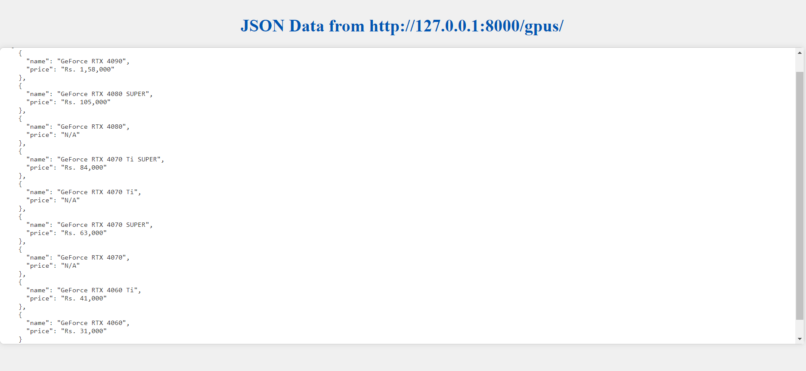

# SITE SCRAPING API

A screenshot on final working





## Installation
To run locally follow the following steps


```bash
  git clone https://github.com/Prateek-Agarwal2006/SITE-SCRAPPER.git
   cd SITE-SCRAPPER
```
Set up Env 
```bash
python -m venv env
source env/bin/activate  # On Windows use `env\Scripts\activate`
```
Install dependencies
```bash
 pip install -r requirements.txt
```
Set Up Config File as .env and in that
```bash
SECRET_KEY=your_secret_key
```
To generate sectret key bash on terminal and paste it in place of your_secret_key or if that not works directly paste it in place of settings.py
```bash
python -c 'from django.core.management.utils import get_random_secret_key; print(get_random_secret_key())'

```
Finally run on terminal
```bash
python manage.py migrate
python manage.py runserver

```

You will get to index.html by running following site on chrome
```bash
http://127.0.0.1:8000/

```
If there is any problem in fething data that might be due to chromedriver you can follow documentation of sellenium for that or on linux bash on terminal
```bash
sudo apt-get install chromium-chromedriver

```


    